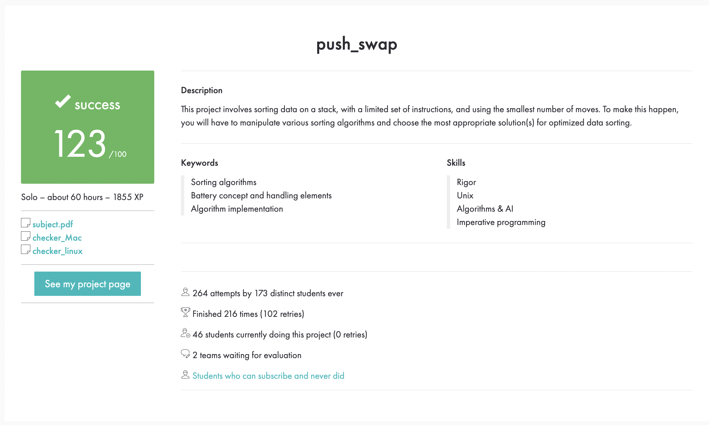

# Push_swap



## 📌 Overview

The push_swap project is a sorting algorithm challenge from 42 School.
The goal is to sort a stack of integers with the lowest possible number of operations, using a limited set of stack operations.

This repository contains:
	•	Mandatory part → push_swap executable (sorting program).
	•	Bonus part → checker executable (verifies the correctness of the operations).

⸻

## ⚙️ Features

	•	Sorting with a limited set of stack operations:
	•	sa, sb, ss → swap top elements
	•	pa, pb → push between stacks
	•	ra, rb, rr → rotate stack upwards
	•	rra, rrb, rrr → rotate stack downwards
	•	Optimized algorithms depending on the number of elements (small vs. large datasets).
	•	Bonus: checker that simulates operations and validates results.
 
⸻

## 🔧 Compilation

#### Build push_swap
```c
make
```

#### Build checker (bonus)
```c
make bonus
```

#### Clean object files
```c
make clean
```

#### Full cleanup
```c
make fclean
```

#### Rebuild everything
```c
make re
```

Executables after compilation:
	•	./push_swap
	•	./checker (bonus)

⸻

## 🚀 Usage

### Mandatory
```c
./push_swap 4 67 3 87
```
Output: sequence of stack operations to sort the list.

### Bonus (Checker)
```c
./push_swap 4 67 3 87 | ./checker 4 67 3 87
```
Output: OK if sorted, KO otherwise.

⸻

## 🧠 Algorithms
	•	For small input (≤ 5) → hardcoded small sorting solutions.
	•	For large input (> 5) → my representation of Turk algorythm
	•	Indexing elements
	•	Chunk-based sorting
	•	Efficient rotations & pushes

⸻

## 📊 Performance
	•	Designed to minimize the number of operations.
	•	Evaluated with different input sizes (100, 500, etc.).

⸻
@Project developed as part of the 42 curriculum
⸻
